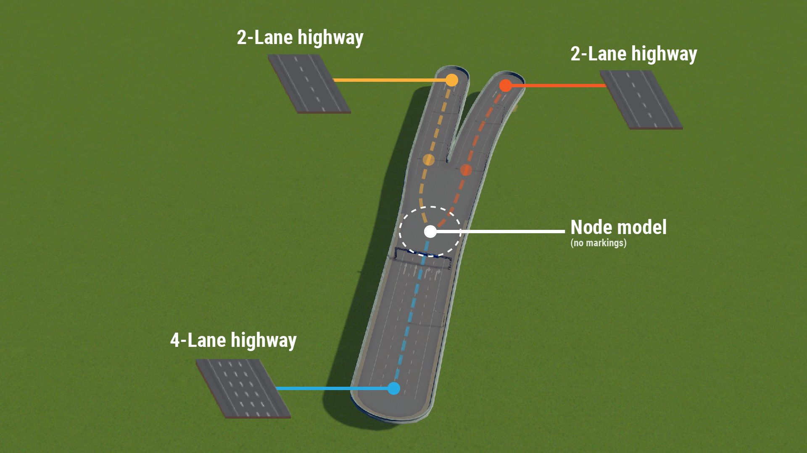
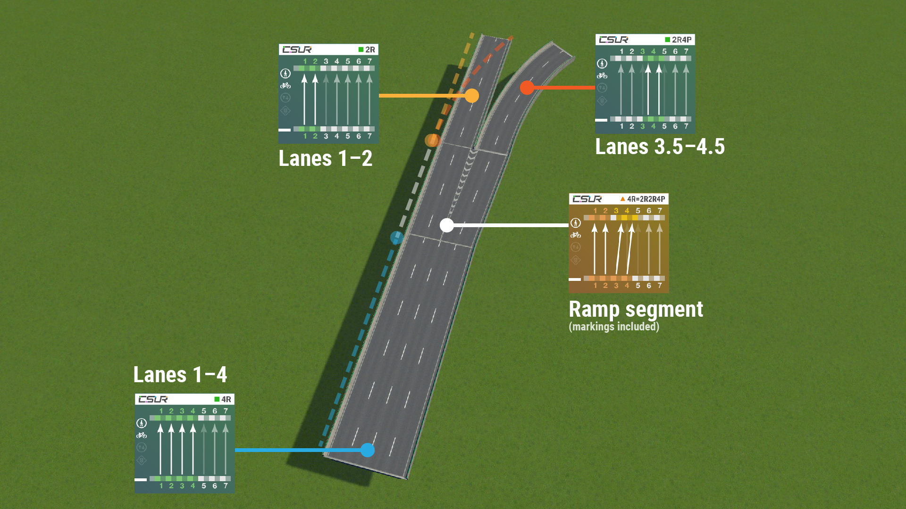
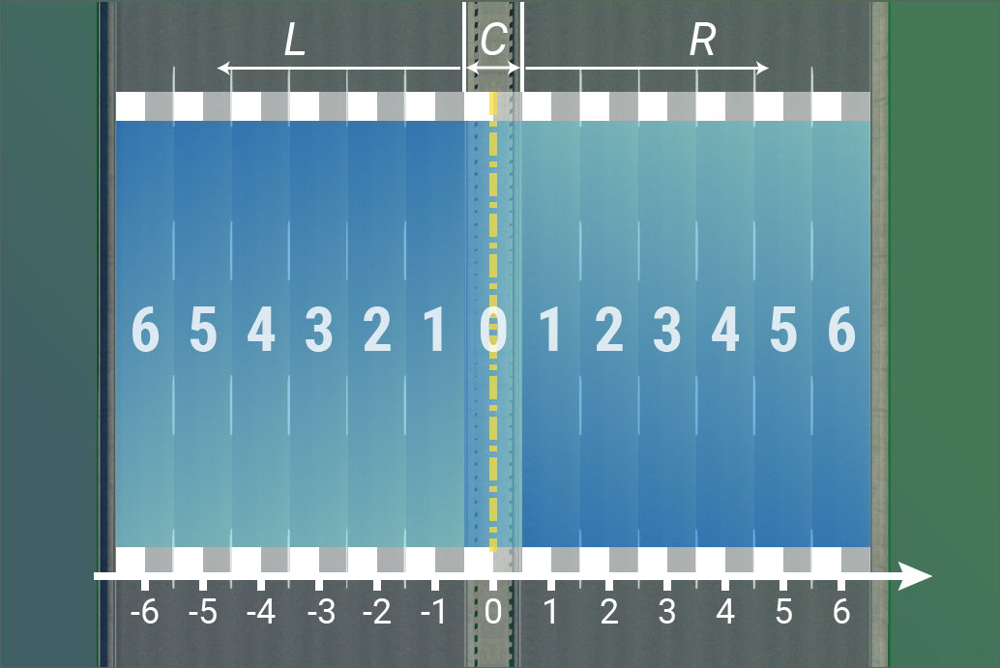
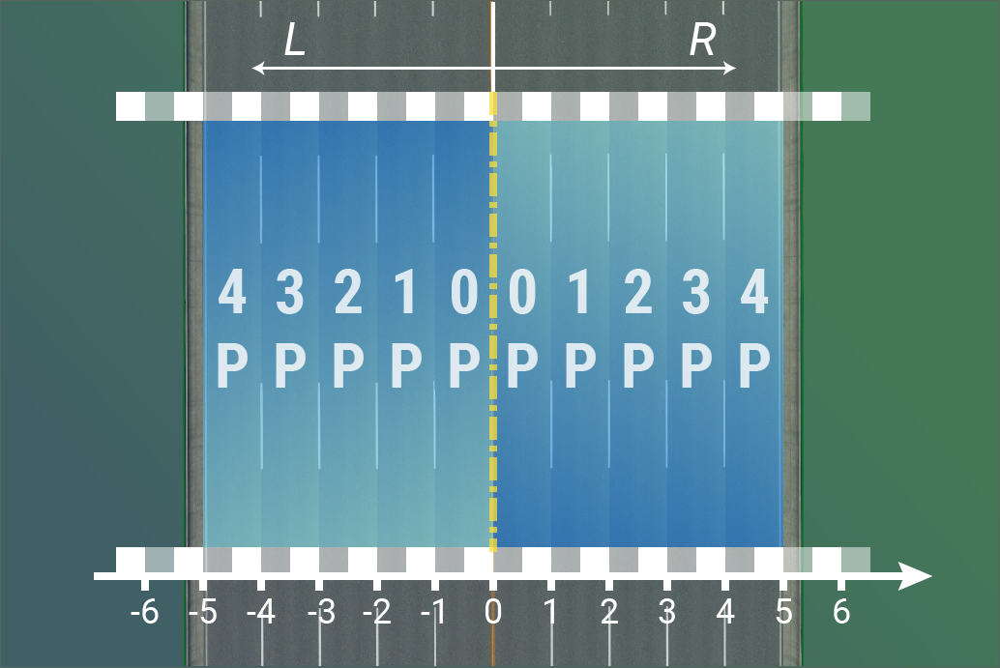
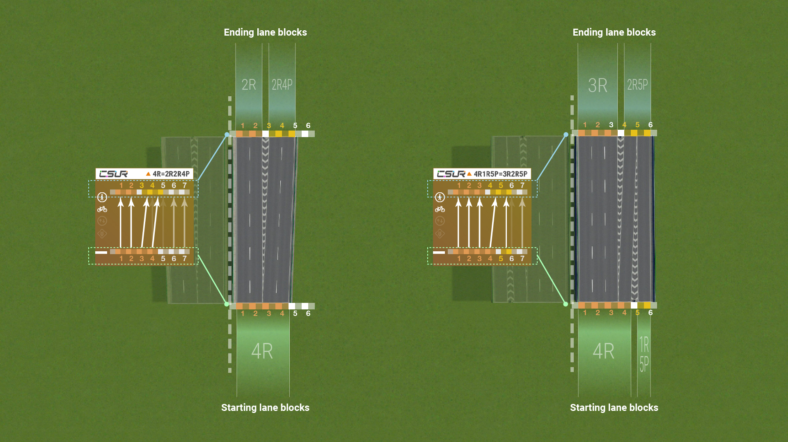

# Getting Started
CSUR (Cities: Skylines Urban Road) is a road building system developed for the game *Cities: Skylines*. CSUR helps players to more efficiently build realistic road infrastructures and massive road networks.

## Key Concepts of CSUR
### Vanilla game: road-based construction
In the vanilla Cities: Skylines game, the road network in a city is built on a "road-by-road" basis. This implies that each road asset you use when building a city represents an entire road. Let's look at a simple example. As shown in the figure below, a 4-lane highway is split into two 2-lane highways. Since vanilla roads are really "road-based" and both left and right forks are 2-lane highways, these forks are exactly identical roads. In other words, the vanilla game cannot distinguish between a left fork and a right fork in a ramp.
 

The road-based system in vanilla Cities: Skylines has given rise to some obvious problems, making it highly labor-intensive to build photo-realistic road infrastructures. The inability for the game to distinguish between left and right forks makes it unable to create road markings at ramps. For instance, one lane forked out of a 4-lane highway can be either a left exit or a right exit, yet the game cannot tell one from the other. Another example is where a lane begins or ends on a road. When a 3-lane road becomes a 4-lane road in the real world, a lane is usually added to the left or right of the road, which makes the 3-lane and the 4-lane aligned to the right or to the left, respectively. However in the vanilla game, directly connecting a 3-lane road to a 4-lane road will make them aligned to the center. As a result, one has to carefully adjust the position of the roads using Move It and manually place lane markings so as to build realistically in the vanilla road system. This is also the common practice of road building by most Cities: Skylines detailers to date.

### CSUR:  Lane-based construction
In stark contrast to the vanilla road system (including the majority of road assets on the Workshop), CSUR adopts a fundamentally different idea of road building, that is, on a "lane-by-lane" basis. This implies that each CSUR road asset (or module) represents one or more groups of lanes in a road instead of an entire road. Let's again look at the example corresponding to the vanilla road ramp. As shown in the figure below,  a 4-lane CSUR elevated road is forked into two 2-lane roads. Since CSUR modules are based on lanes, the 4-lane road comprised of 1st--4th lanes is forked in to the left branch which is the first and second lane and the right branch which is the third (and a half) and fourth (and a half) lanes. (a space of half a lane is needed to place the road barriers) The left and right branches are located at different positions, and thus they are two different CSUR modules (2R and 2R4P). 

Therefore, an interface module in CSUR specifies how lanes are connected to each other (such as adding, removing, and fork), which naturally has all lane markings pre-built and perfectly smooth road connections in one piece. Compared with the vanilla road system, CSUR undoubtedly takes some time to learn. However if you are keen on detailing your city, using CSUR will save lots of time placing lane markings and other props, with a bonus of being harder to hit the game prop limit.

## Intoduction to CSUR Modules and Naming

Due to the aforementioned lanes-based construction concept, CSUR includes an extremely large number of road assets. For example, there can be 6 different 1-lane roads given the maximum road width of 6 lanes. Taking various possible interface modules into account, we are publishing nearly 400 different CSUR modules onto the Workshop. To facilitate mass production of road assets, we developed a road modeling software which runs on Blender and a mod to the game which automatically imports roads into the Asset Editor. If you cannot find the module you need in CSUR packs on the workshop, or you wish to build your own CSUR pack from scratch, you will only need to download Blender, the CSUR modeling software, and the Road Import mod. There is no need for skills on 3D modeling or asset making at all, and you can make a custom road in the course of a few minutes.

Nomenclature of CSUR modules is highly programmatic. Given the name of a CSUR module, its lane connections are uniquely identified. This also makes it easier to search for a desired CSUR module in the game. Here, we start from CSUR's numbering of traffic lanes and then introduce how each module is named.

#### Lanes
CSUR numbers traffic lanes in a very simple way. Beginning from the center of the road, the lane exactly aligned to the center of the road is the zeroth lane, analogous to the origin of a coordinate system. Then, the lane next to the zeroth lane to the right is the first lane, next to the first lane is the second lane, and so forth.

Additionally, lanes numbered by 0.5 are also used, such as a lane whose left border is snapped to the center of the road. Such a lane is halfway to the right of the zeroth lane, so it is the "+0.5"th lane. Because names with dots are likely to confuse computer programs, CSUR replaces the ".5" number with a letter "P". Hence, the lane next to the center of the road is numbered as 0P, right to it is 1P, and so forth.

#### Lane blocks
A lane block, or a carriageway, is a group of one or more contiguous lanes. A lane block is named by its position (left, center, right) and the number of lanes. Consider a group of 4 lanes as a block. If the 4-lane block is aligned to the center of the road, then it is called 4C. If the block is offset to the right side of the road, it will be numbered by the position of the rightmost lane. For instance, if the rightmost lane is the 5th lane the block is called 4R5. Conversely, the block will be numbered by the leftmost lane if it is offset to the left (e.g., 4L5). CSUR was initially developed for right-hand traffic so currently no left-offset modules are present. This naming scheme makes it straightforward to obtain the position of a lane block from its name. For example, 3R4 means a group of three lanes towards the fourth lane to the right (i.e., 2nd--4th lanes). A special case is that the position number of a lane block is omitted if it starts from the first lane, such as 2R2 is abbreviated to 2R and 3R3 to 3R.

#### Modules
A CSUR road module is composed of a set of starting blocks and ending blocks connected along the direction of traffic. Four types of CSUR modules exist, which are defined as:
1. Base module: the starting and ending blocks are identical. Examples: 4R, 6DR4.
2. Shift module: the relative position of a block in the whole road changes by shifting to the left or right. Example: 3R=3R4.
3. Transition module: the number of lanes in a block is changed by adding or removing lanes. Example: 3R=4R.
4. Ramp module: multiple lanes blocks are merged and/or splited between the start and end. Examples: 4R=2R2R4P, 3R3R6P=2R2R4P2R7

The latter three types together are also called interface modules. The module logic of CSUR guarantees that any arbitrary combination of starting and ending blocks is classified into one of the four types of modules. Modules are named by (starting blocks)=(ending blocks). Since base modules have identical starts and ends, the equal sign and the part after it are omitted. It is as well straightforward to figure out the lane connections from the name of a module. For example, 3R3R6P=2R2R4P2R7 is a ramp module which splits two blocks of lanes, 3R and 3R6P, into three blocks of lanes, 2R, 2R4P, and 2R7.  

The above text describes the naming of one-way modules. As for two-way modules, cases are different where they are symmetric or asymmetric. If a one-way module is simply mirrored to give a two-way module, then it is named by multiplying the number of lanes by 2 and appending the number by a letter "D". In this ways, two 3Rs become a 6DR and two 5R6s become a 10DR6. If the edge on the one-way module is on the center of the road, mirroring it results in an undivided two-way road, which is equivalent to drawing a center line onto a group of centered lanes. When 2R1P is mirrored, the resulting two-way road is essentially a 4C with two traffic directions, therefore it is called 4DC. If a two-way module is asymmetric, then it is simply named as (left module)--(right module), for example, 3R4--4R and 2R3--4R3.

## Using CSUR road assets
The functionality of a CSUR road asset is indicated in its thumbnail icon and the text description. One module may have multiple assets, corresponding to different styles and intended use (e.g, whether there is a bike lane or not).

## Relationship with former releases
The current CSUR system succeeds the previous CSUR road pack in 2018 (link) and the even earlier CSUE road pack (link) in 2017. Substantial improvements have been made compared with these older road packs. All assets in the former releases ('18 CSUR and CSUE) were handcrafted piece by piece so their names were not as standardized as our current version. However, they still followed a consistent lane numbering scheme, which eases the connection and inter-conversion between the old versions and the new CSUR. Below is a list of corresponding lane numbers in the current and former versions of CSUR. *n* denotes the number of lanes in the module.

| CSUR(2018) and CSUE | CSUR (2019) |
|--|--|
| *n*R4 | *n*R2 |
|*n*R5 | *n*R3 |
|*n*R5P | *n*R3P |
|*n*R6 | *n*R4P |
|*n*R7 | *n*R5P |
|*n*R9 | *n*R7 |

A complete reference table containing the standardized CSUR names for former road assets is given in [this link](compatibility.md). You may find it useful if you have been playing the former CSUR/CSUE and would like to switch to the new version.

## Compatibility
CSUR was designed to be completely independent of the Cities: Skylines vanilla road system to optimize user experience. This means that you can build your city using only CSUR road assets, which is also the recommended way to use it. This also indicate that we cannot guarantee compatability between a CSUR road asset and any other road asset not developed under the CSUR standard or software framework, although we have tried our best to maintain such compatibility. CSUR roads as were published in October 2019 are able to connect to all vanilla tiny, small, and medium roads without model glitches. When CSUR roads are connected to vanilla highways, the junction will sink below the road surface and vehicles will seem to be floating when passing the junction.

## Limitations
