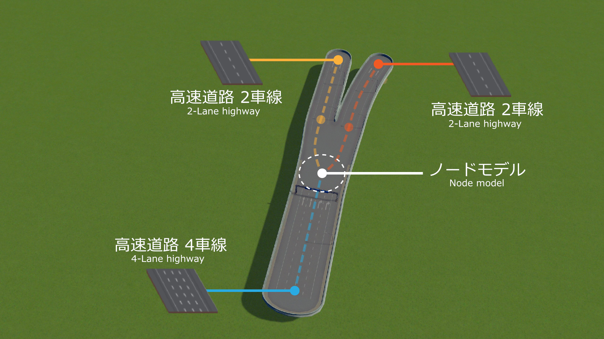
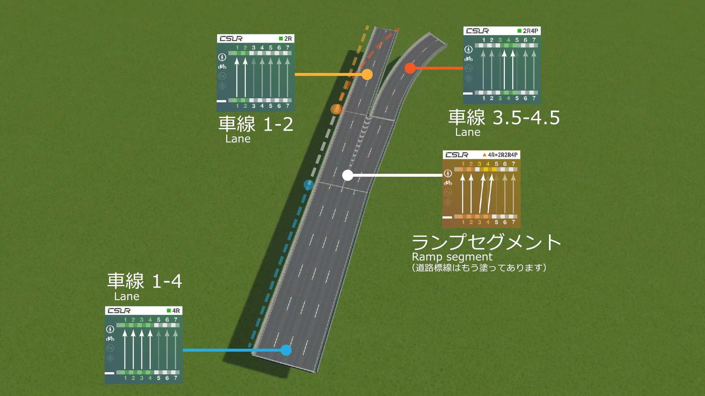
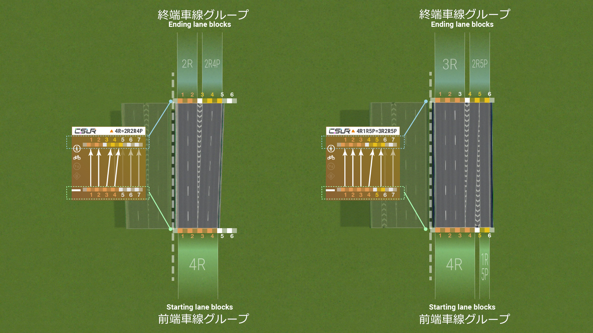

# 使用説明 
## 通訳のレベルが限られていますので、ある段落で分かりやすい言い方があったら、私達に投稿してください。ありがとうございます！
CSURはゲーム「Cities:Skylines」のために開発された道路建設システムです。ゲーム内の従来の道路（バニラの道路）に比べて、CSURはより効率的で本物に近い道を作ることができ、複雑で巨大な交通ネットワークを作ることができます。

## CSURの核心概念
#### 従来の道路：道路（Road）モジュール単位での結合。
Cities:Skylinesの従来の道路は、道路モジュールを単位にしたものです。
つまり、道路に使われている各モジュールはそれ単体で「一つの道路」として機能しています。
簡単な例を見てみましょう。 図の中で、4車線の高速道路は二つ2車線の高速道路に分かれています。従来の道路モジュールでは、4車線の高速道路が2車線の独立した道路に分岐していますが、分岐している先の道路モジュールは同じモジュールです。つまり、従来の道路では左右に分岐した道路をゲーム内で区別することができません。

このため、Cities:Skylinesの従来の道路システムはいくつかの問題を持っており、プレイヤーはリアルな道路を作るために多くの時間と労力を必要としてきました。
たとえば、ゲーム内で分岐した道路を区別できないということは、正しい路面標示ができないことを意味します。
また、現実世界で3車線の道路が4車線に広がるときにも、普通は左右どちらかから車線が増えてくるものですが、このゲームでは道が中央に揃えられてしまうため、Move It!などを使って車線の一を揃えたり、手動で路面標示のデカールを配置するような作業が必要でした。
このような作業を行うことで、Cities:Skylinesのプレイヤーはようやく本物らしい道路を作ることができていたのです。

#### CSURの道路：「車線（Lane）」に基づいて建設する。
従来の道路システム（workshop上の大部分の道路アセットを含みます）と比較して、CSURは全く違った建設理念を採用しています。CSURでは、道路は「車線」に基づいて建設されます。
これは、CSURにおける道路の構成要素は、「道路全体で1単位」ではなく「車線1車線で1単位」であることを意味します。
元版の高速道路に対応する例を見てみます。 図の中で、CSUR4車線の高速道路は2つの2車線の高速道路に分かれています。CSURは「車線」に基づいて建設されるため、1～4車線からなる4車線の道路は1-2車線の左分岐と3-4車線の右分岐に分かれています。実際には間に0.5車線分のガードレールが入るため、右の分岐は便宜上3.5車線-4.5車線と表すことができます。
このようにCSURの道路では、同じ二車線の道路でも、1-2車線と3.5-4.5車線で異なる道路として区別され、異なるCSURモジュールと接続することになります。

このような形をとったおかげで、CSURの各インターフェースモジュール（道路同士を繋ぐモジュールのことをインターフェースモジュールといいます）は、その道路における車線の変化（増減や分岐など）のデータを区別できるため、あらかじめ完全で滑らかな路面標示を組み込むことができました。
これは間違いないことですが、CSURを使うためにはそれなりの学習が必要です。しかし、景観を追求するプレイヤーにとっては、CSURを使うことで圧倒的に道路を装飾するための手間を省くことができるため、その学習には大きなメリットがあるといえます。
また、道路装飾に要するPropやデカールが減るということは、ゲーム内のProp数上限に達する確率が低くなることも意味します。

## CSURのモジュールと命名について

前述のコンセプトを実現するため、CSURには非常に多くの道路モジュールが含まれています。
例えば、幅が6車線の道路に接続する1車線の道路は6種類必要です。6車線の左側1つ目に繋がる道路、左側2つ目に繋がる道路……と、車線別に道路を区別しているからです。
それに加え、さまざまな分岐・車線の増減を含んだインターフェースモジュールを加えると、CSUR全体でのアセットの総数は400近くにもなります。
これだけの大量の道路モジュールを高速で制作するため、私たちはBlender上で動作する道路のモデリングツールを開発しました。また、道路をアセットエディタに自動でインポートするMODも開発しました。
もしあなたが必要とする道路モジュールが存在しない場合や、自分で道路をカスタマイズしたい場合には、Blenderとその上で動作するモデリングツール、MODの3つを揃えるだけで、モデリングや1からのアセット制作を行うことなく、たった数分でカスタマイズした道路を制作することができるのです。

CSURのモジュール名はとても規則的です。モジュール名はその対応する道路の接続方式を一意に決定することができます。このため、必要なCSURのモジュールを検索することがとても簡単になります。

それでは、CSURの命名規則について紹介していきましょう。

#### 車線
CSURでは一定の規則に基づいて、車線とその座標に対しナンバリングして区別します． 道路の中心線(対面通行道路なら中央線や中央分離帯、高速道路は進行方向左側)を座標の基準として、右に第1車線，第2車線，第3車線…と呼びます。
左側通行で道路を作る場合にもこれは変わりません。進行方向左側が常に1車線になります。

なお、車線は0.5車線分ズレることもあります。例えば間に中央分離帯のない対面2車線の道路は、左右どちらの車線も第0.5車線となります(1車線分の中央分離帯がある道路では基本的に整数車線となります) 。
ファイル名に小数点(ピリオド)が入るとプログラムに問題が発生しやすいので、CSURでは「.5」をPと表すことにしています。つまり中央分離帯のない道路の一番内側の車線は第0P(=0.5)車線で、その隣は第1P(=1.5)車線、さらにその隣は第2P(=2.5)車線…となります。

#### 車線グループ
複数の隣り合って並んでいる車線は、「車線グループ」として扱われます。直進・合流・平行移動といった線形は車線グループごとにまとまって変わっていき、モジュール名もこの車線グループの位置とその車線数によって定められています。

例えば、4車線の一方通行の道路を想像してみてください。この道路が中心線に対して中央に配置されていれば、それは4Cと呼びます。
一方で、その4車線が右側にずれて配置されているものはRとなります。4Rを同じ中心線に対して進行方向を逆で並べると、右側通行の8車線の道路が出来上がることになります。
同じく左側にずれている場合にはLとなります。
さらに、その後ろに車線グループの中で一番外側の車線の**座標**を表す数字を付加して呼びます。例えば中央線に対して右側にずれており，一番外側(この場合一番右側)の車線の座標が第5車線の位置であるような4車線の道路なら4R5となります。（中央に1.5車線分のスペースがあります）。
逆に、中央線に対して左側にずれていて一番左側の車線が第5車線の位置にあるものについては4L5となります。現段階では，CSURは右側通行であり左側にずれた道路はないので，Lがついている道路はありません． 
この法則に則って各車線の位置が明確に定められています。例えば3R4と言われたら、中央線から1.5車線分スペースがあり、右側の第2～4車線の位置に3本の車線がある道路であることが想像できます。

例外的な表記として、車線グループの一番内側の車線が第1車線に配置されている場合(すなわち中央線から0.5車線分だけ開けて左右にズレているようなとき)は、RやLの後ろの数値を省略します。例えば2R2は2R，3R3は3R，4R4は4R…として表記します。これらの道路は中央に揃えて配置することで自然な上下方向の道路が出来ることになります。

#### モジュール
1つのCSURモジュールは1つないし複数の車線グループによって構成されていて。モジュール名はその始点と終点の座標や車線数をもとに命名されています。CSURモジュールは大きく分けて4種類に分かれています。

1.　基本（Base）モジュール：モジュールの両端で車線数やその座標が変化しないもの，すなわち車線が合流や平行にずれることがない，ごく一般的な道路です．例：4R，6DR4

2.　平行移動（Shift）モジュール：車線の数は変えずに，中心線からの座標を左右にずらすときに使います．例：3R=3R4(3Rの道路と，それより1車線分外側にずれている3R4をつなぐために使います)

3.　合流・分岐（Transition）モジュール：1つの車線グループの車線数を増やしたり(分岐)減らしたり(合流)するときに使用します．例：3R=4R(中央線から右にずれている3車線の道路を4車線に分岐できます)

4.　ランプ(Ramp）モジュール：複数の車線グループを1つのグループに合流したり，逆に分離して別のグループにするときに用いるモジュールです．例：4R=2R2R4P(中央線より右側にずれている4車線を，0.5車線ぶん離して分離することができます)

後の3つのモジュールも総称してインターフェース（Interface）モジュールと呼ばれる。CSURのモジュールの論理は、任意の先頭と終端の車線グループを接続することができ、得られたモジュール全てはこの4つの種類の一つに属しています。
モジュールの命名方法は（先頭車線グループ）=（終端車線グループ）です。基本モジュールの先頭とエンドは同じですので、中間の「=」とその後の部分は省略します。モジュールの命名によって、どの車線がつながっているか分かりやすいです。例えば、3R 3R6P=2R 2R4P 2R7は、2つグループの車線（3Rと3R6P）を3つグループの車線（2R、2R4Pと2R7）に分けるランプモジュールです。

上記では、一方向モジュールの命名方法を説明した。双方向モジュールの命名は対称と非対称の二つの場合に分けられる。モジュールを直接に両方向に対称にすると、その名称は従来の一方向モジュールの車道数に「D」をつけ、車道数に2を掛けます。例えば、2つの3 Rが6 DRになり、2つの5 R 6が10 DR 6になります。モジュールが道路の中心線（例えば1 R 0 P、2 R 1 P）にぴったり隣接していると、対応する双方向道路に中央分離帯がない、中間は1本の双実線で置換します。例えば、2 R 1 P対応の双方向モジュールは、双実線の4 Cであるため、4 DCと呼ばれています。双方向モジュールが非対称であれば、直接に（左モジュール）–（右モジュール）で名前を付けます（例えば、3R4–4Rと2R3–4R3）。

## CSUR道路アセットを使用する
各CSURアセットのサムネイルと文字記述にはその機能が示されています。同じモジュールに複数のアセットがありは可能です、それぞれ異なる様式と異なる使用の場合に対応します（例えば自転車レーンの有無）。

## 前期バージョンとの関係
現バージョンのCSURシステムは [2018年の旧版CSUR](https://steamcommunity.com/workshop/filedetails/?id=1423096565) とより早く [2017年のCSUE](https://steamcommunity.com/workshop/filedetails/?id=1206133771)の後継者です。この二つの前期バージョンに比べて、新版のCSURには多くの重要な改善が含まれています。前期バージョン（2018版CSURとCSUE）の道路アセットは手作りで作られているので、そのネーミングは新版CSURに対してそんなに標準化されていません。しかし、前期のバージョンも同じ車道の命名方式を使用しています。対応する旧版と新版モジュールの相互変換や接続も容易です。下表は新版CSURと前期バージョンの車道番号の対応関係を示しています。nはモジュールの中車道の数を表します。

| CSUR(2018), CSUE | CSUR (2019) |
|--|--|
| *n*R4 | *n*R2 |
|*n*R5 | *n*R3 |
|*n*R5P | *n*R3P |
|*n*R6 | *n*R4P |
|*n*R7 | *n*R5P |
|*n*R9 | *n*R7 |

旧バージョンCSURの標準化モジュール名対照表は、[このリンク](compatibility_jp.md)を参照することができます。旧バージョンCSUR/CSUEを使ったプレイヤーに役立ちます。

## 互換性
ユーザー体験を最適化するために、CSURは完全に元版道路システムから独立して設計されました。これはCSURの道路だけを使ってあなたの都市を作ることができるという意味です。これはまた、CSURの互換性を向上させるために努力しても、CSUR道路とCSUR規格以外またはCSURソフトウェアフレーム以外で作成された道との完全互換性を保証することができないということです。CSURは2019年10月に発表された道路資産と元版ゲームの小道、二車線道路と四車線道路がつながっていて、模型が破損することはありません。CSURと元版高速道路を接続すると、インターフェースは路面以下に沈んでしまい、インターフェースを通る時に車両が空中に浮くようになります。

## 限界性
**CSURは万能ではないです。**

