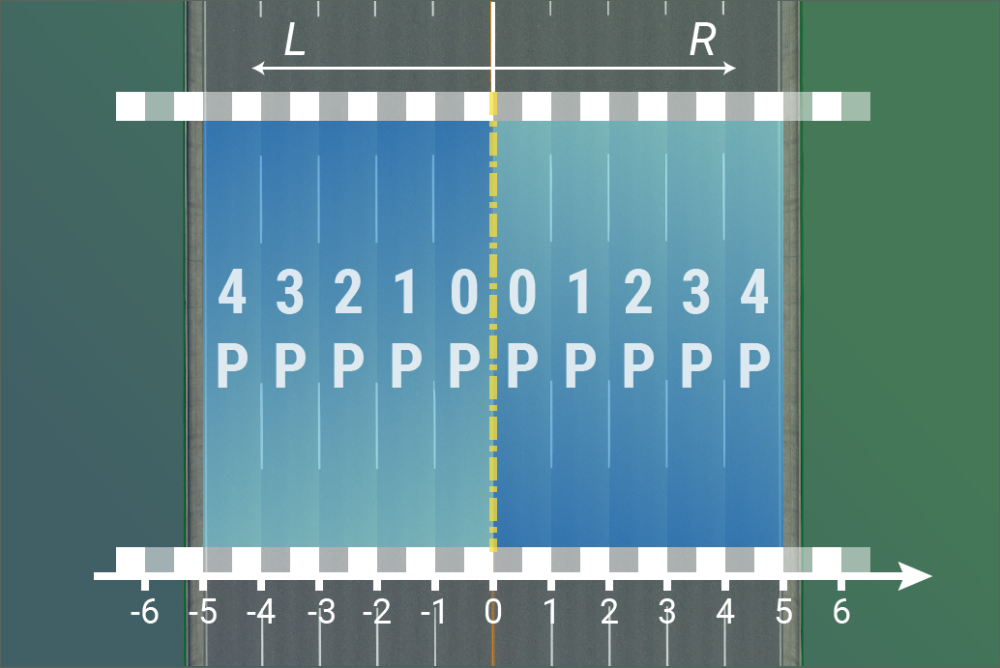

# 使用説明 
## 通訳のレベルが限られていますので、ある段落で分かりやすい言い方があったら、私達に投稿してください。ありがとうございます！
CSURはゲーム「Cities:Skylines」のために開発された道路建設システムです。ゲーム内の元版の道路に比べて、CSURはより効率的にゲームの中に真実の道を作ることができ、複雑で巨大な交通ネットワークを作ることができます。

## CSURの核心概念
#### 元版ゲーム:「道（Road）」に基づいて建設する。
Cities:Skylinesの元版のゲームの中で、都市の道路ネットの建設は「道（Road）」を単位にしたのです。これはつまり道路建設に使われる各モジュールが「一つの道」を表しているということです。
この簡単な例を見てみましょう。
図の中で、4車線の高速道路は二つ2車線の高速道路に分かれています。原版のゲームの道路のモジュールは「道（Road）」を単位としており、しかもこの道の左右の分かれ道は2車線の高速道路であるため、ですから、この二つの分かれ道がつながっている道のモジュールは同じです。つまり原版ゲームは一つの分岐点の方向を区別することができません。

そのため、Cities:Skylinesの元版道路のシステムはいくつかの明らかな問題を持ってきました、たから非常に現実的な道路施設の建設に多くの時間と精力を必要とします。ゲーム内の仕組みでは、分岐の方向が知らない。正しい道路標線の表示ができないことを意味します。
もう一つの例は、同じ道路の車線の数の増減です。現実の世界では、3車線の道路は4車線に広がり、一般に右や左からに車線を増やすのが、所在地によって右側に揃えたりや左側に揃えたりします。ゲーム中に4車線を3車線で結ぶと、この2つの道が中央に揃えられます。
元版の道路システムでは、move itを使って道路の分岐点を調整し、手動で道路標線を塗る必要があります、このようにしてこそ，真実の効果が得られる。これも大部分のCities：Skylinesプレーヤーがよく使う方法です。

#### CSUR:「車線（Lane）」に基づいて建設する。
元版の道路システム（workshop上の大部分の道路アセットを含む）と比較して、CSURは全く違った建設理念を採用して:CSURは「車線」に基づいて建設されます。これは、CSURの各道路構成要素が、道路全体を表してではなく、この道の1つまたは複数の車線を表していることを意味する。
元版の高速道路に対応する例を見てみます。
図の中で、CSUR4車線の高速道路は二つ2車線の高速道路に分かれています。CSURは「車線」に基づいて建設されであるため、1～4車線からなる4車線の道路は1-2車線の左分岐と2（.5）-4（.5）車線の右分岐（ここの半車線の幅は、ガードレールを追加のに使います。）に分かれています。左右の分岐の2つの車線の位置が異なり、それらは2つの異なるCSURモジュール（2Rと2R4P）に対応しています。

したがって、CSURの各インターフェースモジュールは、車線ごとの変化（増減、分岐など）を決定している、あらかじめ道路標線を塗り、これは完璧で滑らかなインターフェースを作ることができます。
元版道路システムと比べて、CSURはより多くの時間をかけて勉強します。しかし、景観を追求するプレーヤーにとっては、CSURを使うことで、大量の道路標線を置く時間を省き、さらにゲームのpropの上限に達するのが難しくなります。

## CSURのモジュールと命名概要
前述の概念のために、CSURは非常に多くの道路モジュールを含む。例えば、幅が6車線を超えない場合、1車線のモジュールは6種類あります。それに、いろいろな可能性のあるインターフェースモジュールを加えて、Workshopで公開されたCSUR道路の統合アセットの総数は400近くにもなります。大量の道路モジュールを高速で生産するために、私たちにBlenderに基づく道路モデリングソフトを開発しました。また、ゲームアセットエディタで使用して道路にMODを自動に導入します。もしがWorkshopが発表した道路パックの中に欲しいなモジュールがないことを発見したら、あるいは自分でCSUR道路のパックをカスタマイズしたい、3 Dモデリングやアセット作成のスキルが必要ではなく、数分以内にカスタマイズ道路を作ることができます。

CSURのモジュール名は規則的であり、モジュール名はその対応する道路接続方式を一意に決定することができる。これはまた、必要に応じて検索するCSURモジュールを非常に簡単にする。
わたしたちはCSURから各車線の位置番号を始めて、各種モジュールの命名方法を紹介します。

#### 車線
CSURでは一定の規則に基づいて，車線とその座標にナンバリングをして区別します．
道路の中心線(対面通行道路なら中央線や中央分離帯、右側通行の高速道路は進行方向左側)を座標の基準として、右に第1車線，第2車線，第3車線…と呼ぶことにします。

また車線が0.5車線分ズレることもあります。例えば間に中央分離帯のない対面2車線の道路は左右どちらの車線も第0.5車線となります。(1車線分の中央分離帯がある道路では基本的に整数車線となります)
ファイル名に小数点(ピリオド)が入るとプログラムに問題が発生しやすいので、CSURでは「.5」をPと表すことにします。つまり中央分離帯のない道路の一番内側の車線は第0P(=0.5)車線で、その隣は第1P(=1.5)車線、さらにその隣は第2P(=2.5)車線…となります。

#### 車線グループ
複数の隣り合って並んでいる車線は車線グループとして扱われます。直進・合流・平行移動といった線形は車線グループごとにまとまって変わっていき、モジュール名もこの車線グループの位置とその車線数によって定められています。例えば4車線の車線グループについて、道路の中心線に対して中央に配置されている場合は単に4Cと呼びます．一方で車線グループが中心線に対して右に配されているものはR，左に配されているものはLを付けて，さらにその後ろに車線グループの中で一番外側の車線の座標を表す数字を付加して呼びます．例えば中央線に対して右側にずれており，一番外側(この場合一番右側)の車線の座標が第5車線であるような4車線の道路なら4R5となります．逆に中央線に対して左側にずれていて一番左側の車線が第5車線の位置にあるものについては4L5となります．現段階では，CSURは右側通行であり左側にずれた道路はないので，Lがついている道路はありません．
この法則に則って各車線の位置が明確に定められています。例えば3R4と言われたら、中央線から1.5車線分あいて右側に第2～4車線の位置に3本の車線がある道路であることが想像できます。

例外的な表記として、車線グループの一番内側の車線が第1車線に配置されている場合(すなわち中央線から0.5車線分だけ開けて左右にズレているようなとき)は、RやLの後ろの数値を省略します。例えば2R2は2R，3R3は3R，4R4は4R…として表記します。

#### モジュール
1つのCSURモジュールは1つないし複数の車線グループによって構成されていて。モジュール名はその始点と終点の座標や車線数をもとに命名されています。CSURモジュールは大きく分けて4種類に分かれています。

1.　基本（Base）モジュール：モジュールの両端で車線数やその座標が変化しないもの，すなわち車線が合流や平行にずれることがない，ごく一般的な道路です．例：4R，6DR4

2.　平行移動（Shift）モジュール：車線の数は変えずに，中心線からの座標を左右にずらすときに使います．例：3R=3R4(3Rの道路と，それより1車線分外側にずれている3R4をつなぐために使います)

3.　合流・分岐（Transition）モジュール：1つの車線グループの車線数を増やしたり(分岐)減らしたり(合流)するときに使用します．例：3R=4R(中央線から右にずれている3車線の道路を4車線に分岐できます)

4.　ランプ(Ramp）モジュール：複数の車線グループを1つのグループに合流したり，逆に分離して別のグループにするときに用いるモジュールです．例：4R=2R2R4P(中央線より右側にずれている4車線を，0.5車線ぶん離して分離することができます)

後の3つのモジュールも総称してインターフェース（Interface）モジュールと呼ばれる。CSURのモジュールの論理は、任意の先頭と終端の車線グループを接続することができ、得られたモジュール全てはこの4つの種類の一つに属しています。
モジュールの命名方法は（先頭車線グループ）=（終端車線グループ）です。基本モジュールの先頭とエンドは同じですので、中間の「=」とその後の部分は省略します。モジュールの命名によって、どの車線がつながっているか分かりやすいです。例えば、3R 3R6P=2R 2R4P 2R7は、2つグループの車線（3Rと3R6P）を3つグループの車線（2R、2R4Pと2R7）に分けるランプモジュールです。

上記では、一方向モジュールの命名方法を説明した。双方向モジュールの命名は対称と非対称の二つの場合に分けられる。モジュールを直接に両方向に対称にすると、その名称は従来の一方向モジュールの車道数に「D」をつけ、車道数に2を掛けます。例えば、2つの3 Rが6 DRになり、2つの5 R 6が10 DR 6になります。モジュールが道路の中心線（例えば1 R 0 P、2 R 1 P）にぴったり隣接していると、対応する双方向道路に中央分離帯がない、中間は1本の双実線で置換します。例えば、2 R 1 P対応の双方向モジュールは、双実線の4 Cであるため、4 DCと呼ばれています。双方向モジュールが非対称であれば、直接に（左モジュール）–（右モジュール）で名前を付けます（例えば、3R4–4Rと2R3–4R3）。

## CSUR道路アセットを使用する
各CSURアセットのサムネイルと文字記述にはその機能が示されています。同じモジュールに複数のアセットがありは可能です、それぞれ異なる様式と異なる使用の場合に対応します（例えば自転車レーンの有無）。

## 前期バージョンとの関係
現バージョンのCSURシステムは [2018年の旧版CSUR](https://steamcommunity.com/workshop/filedetails/?id=1423096565) とより早く [2017年のCSUE](https://steamcommunity.com/workshop/filedetails/?id=1206133771)の後継者です。この二つの前期バージョンに比べて、新版のCSURには多くの重要な改善が含まれています。前期バージョン（2018版CSURとCSUE）の道路アセットは手作りで作られているので、そのネーミングは新版CSURに対してそんなに標準化されていません。しかし、前期のバージョンも同じ車道の命名方式を使用しています。対応する旧版と新版モジュールの相互変換や接続も容易です。下表は新版CSURと前期バージョンの車道番号の対応関係を示しています。nはモジュールの中車道の数を表します。

| CSUR(2018), CSUE | CSUR (2019) |
|--|--|
| *n*R4 | *n*R2 |
|*n*R5 | *n*R3 |
|*n*R5P | *n*R3P |
|*n*R6 | *n*R4P |
|*n*R7 | *n*R5P |
|*n*R9 | *n*R7 |

旧バージョンCSURの標準化モジュール名対照表は、[このリンク](compatibility_jp.md)を参照することができます。旧バージョンCSUR/CSUEを使ったプレイヤーに役立ちます。

## 互換性
ユーザー体験を最適化するために、CSURは完全に元版道路システムから独立して設計されました。これはCSURの道路だけを使ってあなたの都市を作ることができるという意味です。これはまた、CSURの互換性を向上させるために努力しても、CSUR道路とCSUR規格以外またはCSURソフトウェアフレーム以外で作成された道との完全互換性を保証することができないということです。CSURは2019年10月に発表された道路資産と元版ゲームの小道、二車線道路と四車線道路がつながっていて、模型が破損することはありません。CSURと元版高速道路を接続すると、インターフェースは路面以下に沈んでしまい、インターフェースを通る時に車両が空中に浮くようになります。

