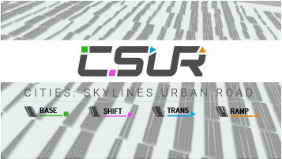

# CSUR -- Cities: Skylines Urban Road

全新版CSUR即将发布！新版我们进一步改善了模型和贴图，还实现了大量新特性，包括带左转专用道的路，BRT路，完整的匝道接口模块合集，所有路均带有隧道模型和车道指示等等。我们还开发了一套程序用来全自动生成和导入CSUR的所有模块，你只要花几分钟就可以定制自己的CSUR路了。

新CSUR已经进入测试阶段。CSUR涉及的资产数量极其庞大，功能也远超出之前发布过的任意一套道路资产，因此测试与调整需要消耗可观的一段时间，才能为大家带来优质的作品，敬请谅解。正式发布之后，我们也会相应地做一系列文档（中文，英文，日文），教程以及速查表。敬请期待！

* 点击这里阅读 [CSUR 上手指南](getting_started_cn.md)
* 关于 CSUR 的一般讨论和测试版体验请加入 QQ 群 575052285
* 如果你是一个DISCORD用户并乐意在该载体上和我们讨论，也可以点[这个链接](https://discord.gg/bdqu5z8)。
* 关于 CSUR 软件的细节请参阅 Reddit 上的[此讨论贴](https://www.reddit.com/r/CitiesSkylinesModding/comments/d8y4xo/csur_automated_creation_of_road_assets_with/) (英文，需科学上网）
* 关于 CSUR 的常见问题请参阅[本页面](faq_cn.md)

All-new version of CSUR coming soon! This time we further improved the models and textures and implemented tons of new features, including roads with dedicated left-turn lanes, BRT roads, exhaustive collections of ramp/interface modules, fully-rendered tunnels, and a lot more. We developed a code to automatically create all CSUR assets using the parameters of each module so making your custom CSUR road only takes a few minutes.

The new CSUR is currently undergoing extensive testing and debugging. The contents and features in CSUR dramatically exceed any road pack on Steam Workshop to date so testing and debugging cost significant amounts of time and effort. We will be also publishing lots of documentations (Chinese, English and Japanese), tutorials and cheetsheets after the Workshop release of is available. Stay tuned!

* Click here for [Getting Started](getting_started_en.md) with CSUR.
* If you would like to discuss about CSUR and its predecessors or try out the testing version of the new CSUR, please join the [Our Discord server](https://discord.gg/bdqu5z8) where we host CSUR-related channels.
* If you are a modder and are intersted in its implementation details, please visit [this Reddit post](https://www.reddit.com/r/CitiesSkylinesModding/comments/d8y4xo/csur_automated_creation_of_road_assets_with/).

新しいバージョンのCSURが間もなくリリースされます！新版では、モデルとテクスチャをさらに改善し、大量の新しい特性も実現した。この中には左カーブ専用道、BRT道路、完全なランプインターフェースモジュールのパックがあります。すべての道路にはトンネルモデルと車道指示などがあります。全自動でCSURを生成して導入するためのプログラムも開発しました、数分間でCSUR道路をカスタマイズできます。

新版CSURはもうテスト段階になりました。膨大な量のアセットや複雑な機能に関わるため、テストと調整には時間がかかります。このようにしてこそ、皆様に良質の作品をもたらします、ご了承ください。同時に一連の文書（中国語、英語、日本語）、教程、速読表も作成します。お楽しみに！

* ここをクリックして [使用説明](getting_started_jp.md)を読みます。
* 詳細については、私たちの[Discord server](https://discord.gg/bdqu5z8)に参加できます。
* CSURに関する一般的な質問は[このページ](faq_jp.md)を参照してください。
